# ProjetJEE Mohammed Amine Rokki
# Encadre par Pr YOUSSFI

Ce projet vise à développer une application de gestion de comptes bancaires en utilisant le framework Spring Boot. L'objectif est de permettre aux utilisateurs de gérer facilement leurs comptes, effectuer des opérations de débit et de crédit, ainsi que consulter les informations relatives à leurs comptes. Le projet est structuré en deux composantes principales : la couche DAO (Data Access Object) qui gère l'accès aux données, et la couche service qui gère la logique métier, les objets de transfert de données (DTOs) et les contrôleurs REST (RestController).

+La couche Dao
    -La création des entités JPA qui représentent les classes qui sont persistées dans une base de données relationnelle, et elles permettent de manipuler ces données de manière transparente en utilisant les fonctionnalités de JPA. 
    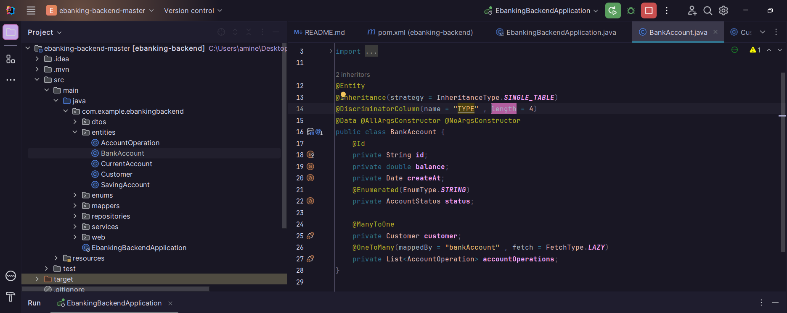

-Ajouter interfaces AccountOperationRepository, BankAccountRepository et CustomerRepository qui héritent de l'interface           JpaRepository fournie par Spring Data. L'utilisation de l'interface 'JpaRepository' permet de bénéficier des fonctionnalités de base pour l'accès aux données, telles que les opérations CRUD et d'autres opérations courantes. 
    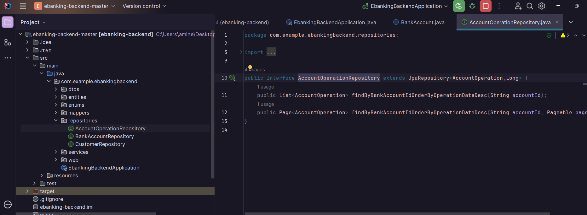

-Ajouter les clients en utilisant l'interface BankAccountService
    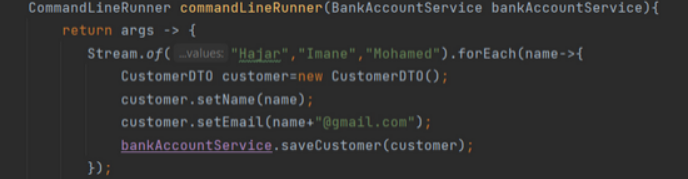

-Ajouter les comptes des deux types CurrentBankAccount et SavingBankAccount pour toute la liste des clients
    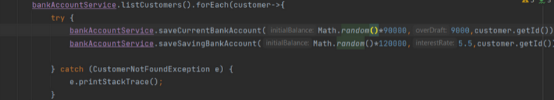

-Le sauvegard
    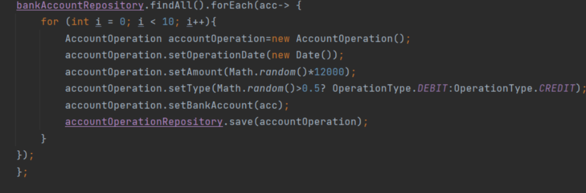

-Bank Account sur myphpadmin
    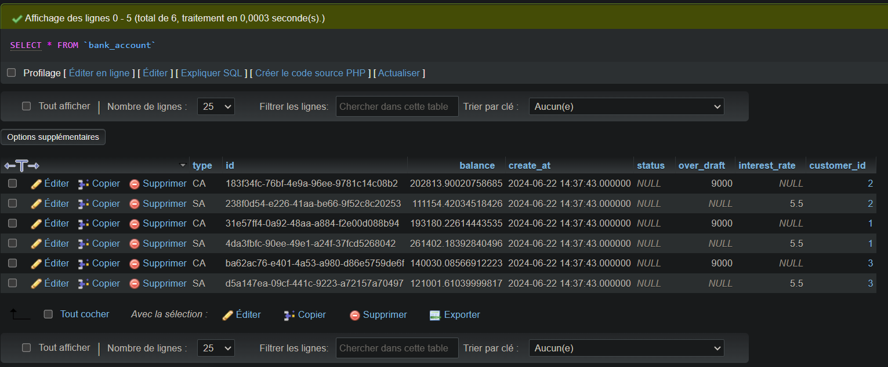

+Test du couche Dao -Implementation des methodes
    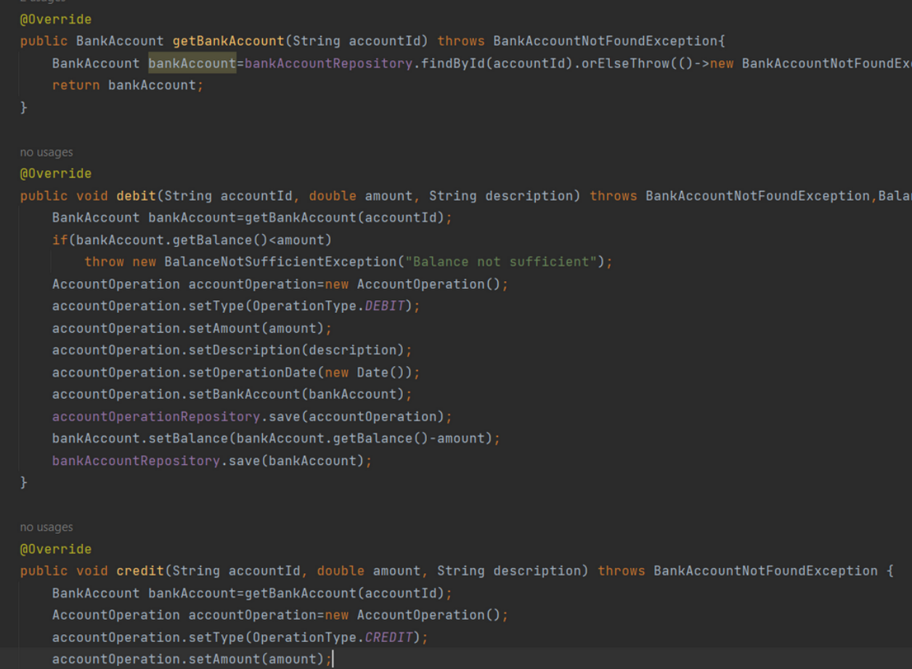

-Pour ajouter des clients, des comptes et des opérations associées en utilisant l'interface BankAccountService, on utilise une implémentation concrète de cette interface, telle que BankAccountServiceImpl. Cette classe permet de créer de nouveaux clients, de créer des comptes pour ces clients, et d'effectuer des opérations telles que les dépôts et les retraits sur les comptes existants.
    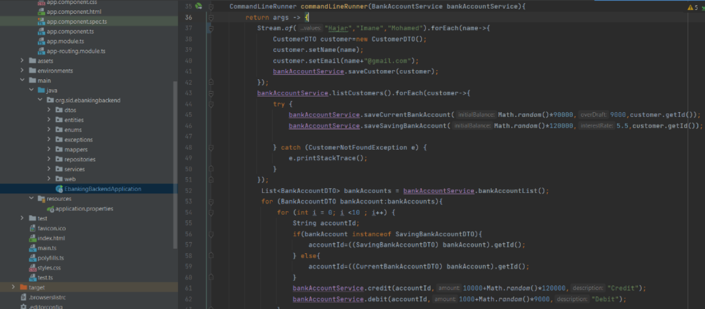

-Créer les deux classes 'BankAccountRestApi' et 'CustomerRestApiController' au niveau du package web; La classe 'BankAccountRestApi' peut fournir des méthodes pour créer de nouveaux comptes, effectuer des dépôts et des retraits, obtenir des informations sur les comptes, etc. Cette classe peut interagir avec l'implémentation de 'BankAccountService' pour exécuter les opérations bancaires correspondantes. La classe 'CustomerRestApiController', quant à elle, peut être utilisée pour la création de nouveaux clients, la récupération des détails des clients, la mise à jour des informations des clients, etc. Cette classe peut également interagir avec l'implémentation de 'BankAccountService' pour effectuer les opérations liées aux clients.
    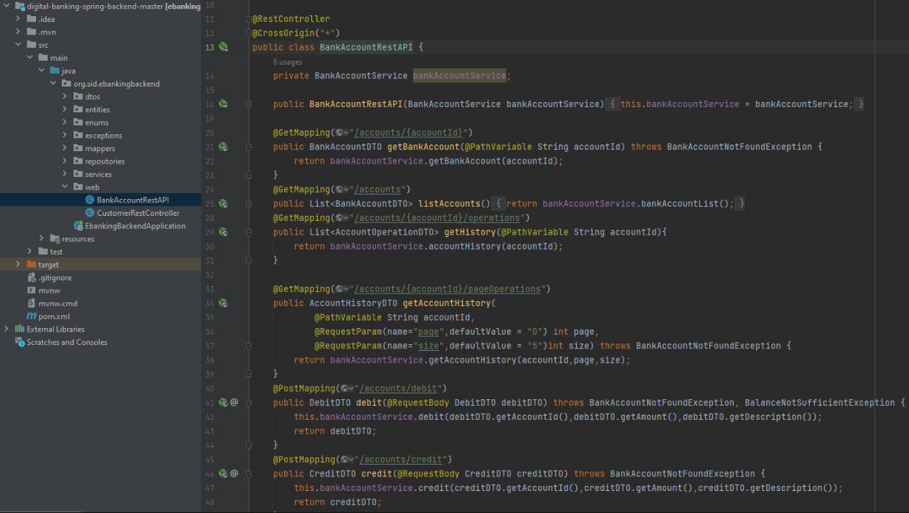
    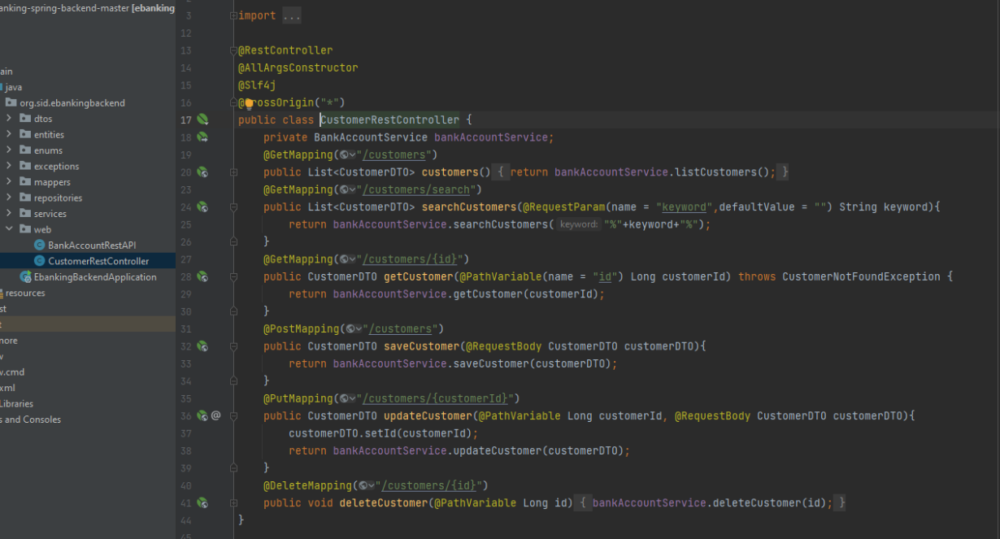

-Ajouter la pagination
    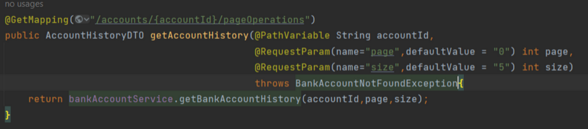

+Angular -Generer les composants
    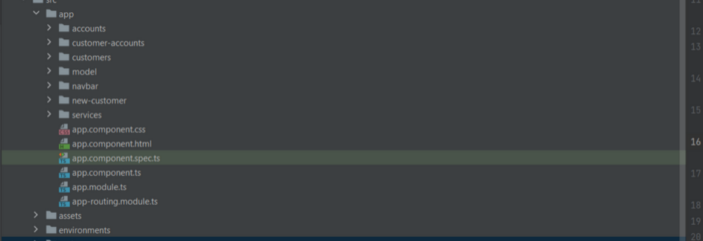

-Ajouter une barre de navigation
    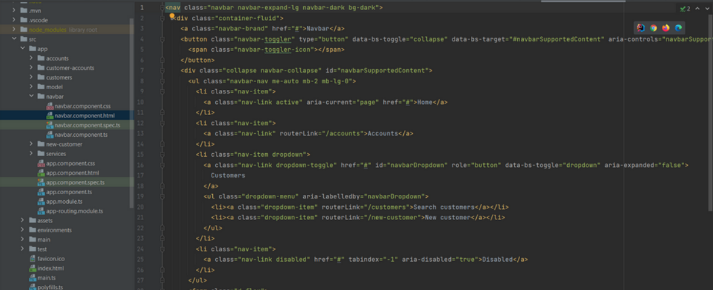

-Pour afficher la liste des clients, on doit installer le module HttpClientModule pour intéragir avec la partie Backend et pouvoir charger les données
    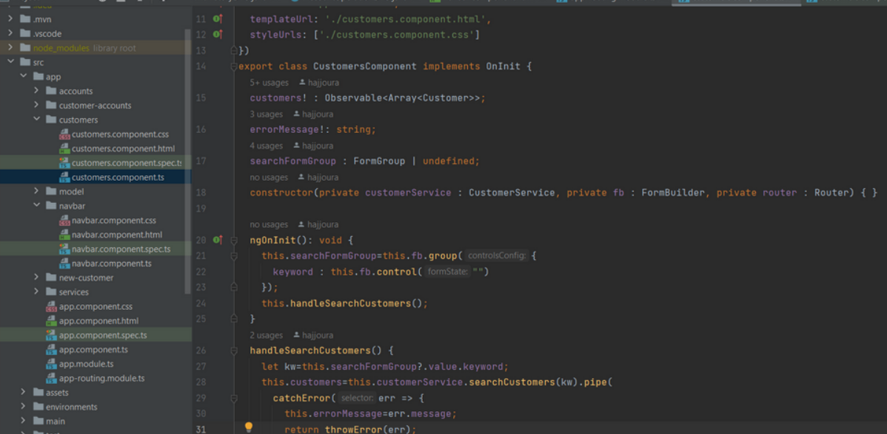

-Créer les deux services appelés CustomerService et AccountService pour pouvoir les injecter dans n'importe quel composant
    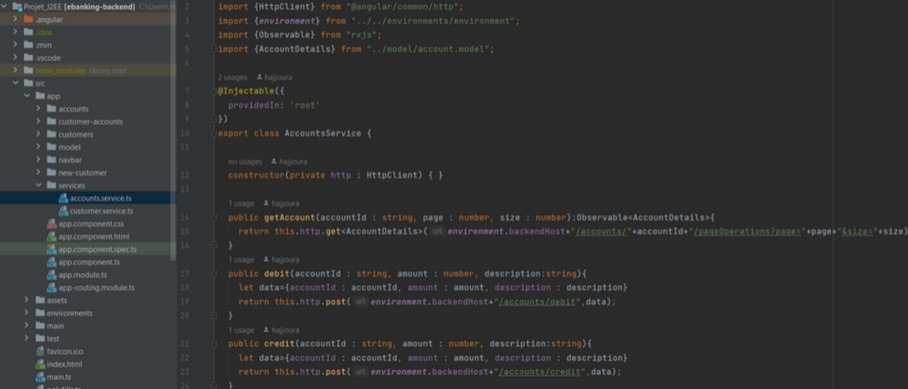
    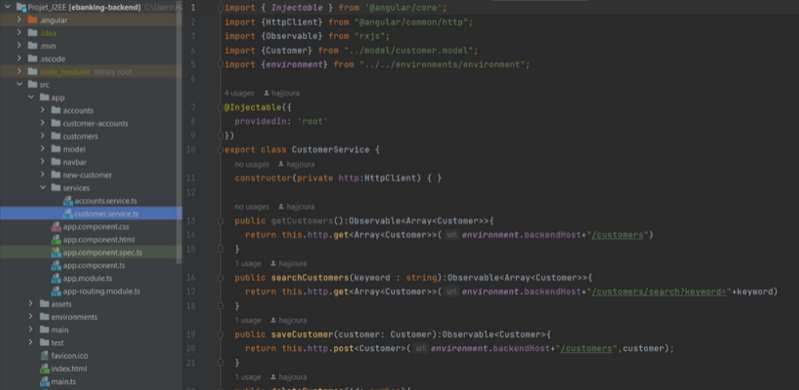

-Créer des classes sous le paquet models qui représentent le modèle
    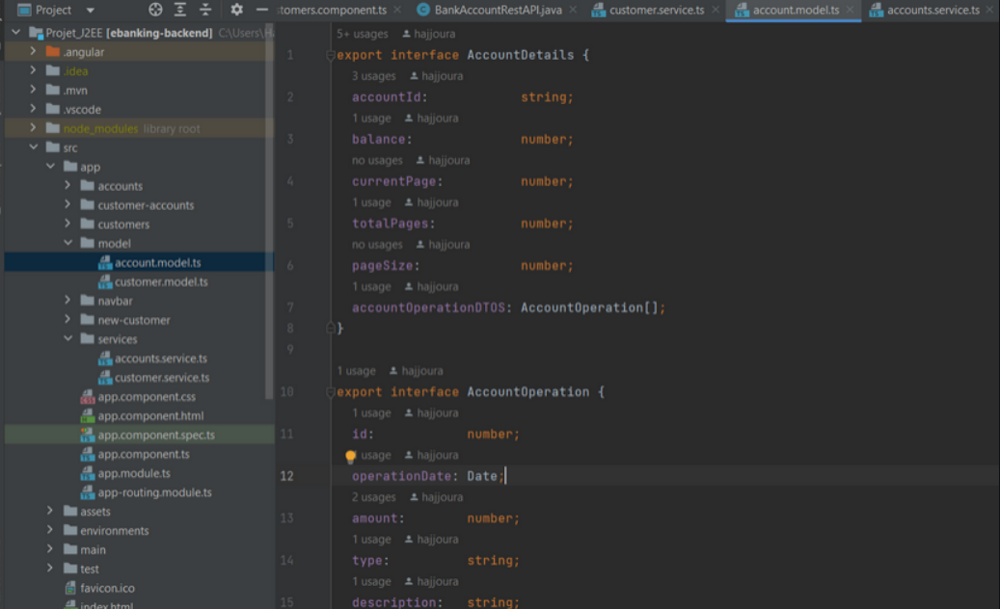

-Créer un fomulaire pour la recherche des clients
    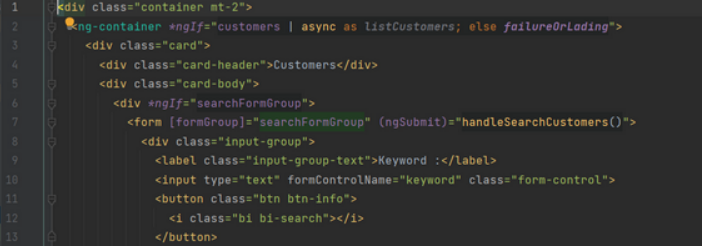

+TEST
    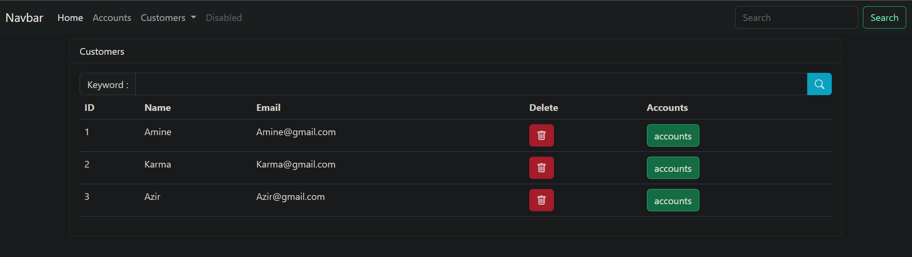
    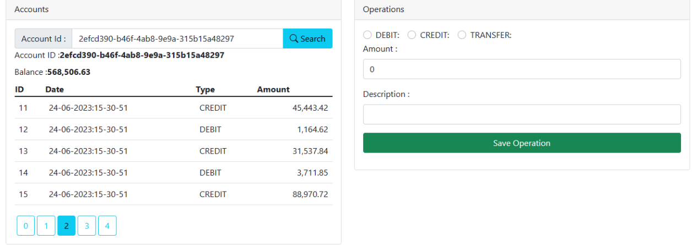

